# Mini Project: Creating Internet Gateway and NAT Gateway with Route Table Configuration

## Purpose
The goal of this mini project is to create an Internet Gateway, a NAT Gateway, and configure route tables for a public subnet and a private subnet within an Amazon VPC using the AWS Management Console. This setup ensures that resources in the public subnet can directly access the internet, while resources in the private subnet can access the internet through the NAT Gateway.

## Objectives:
Project Tasks:
1. Create an Internet Gateway
2. Create NAT Gateway
3. Configure Route Tables

## Project Tasks
### Task 1: Create an Internet Gateway
1. Log in to the AWS Management Console
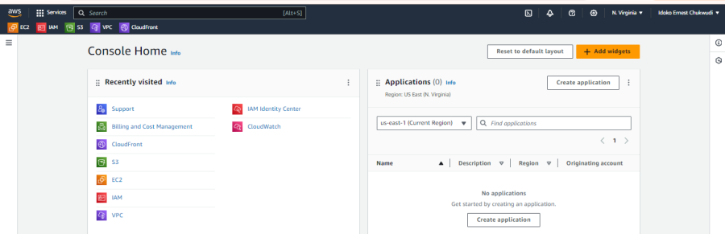

2. **Navigate to the VPC Dashboard:**
- In the AWS Management Console, type "VPC" in the search bar and select "VPC" from the dropdown list.
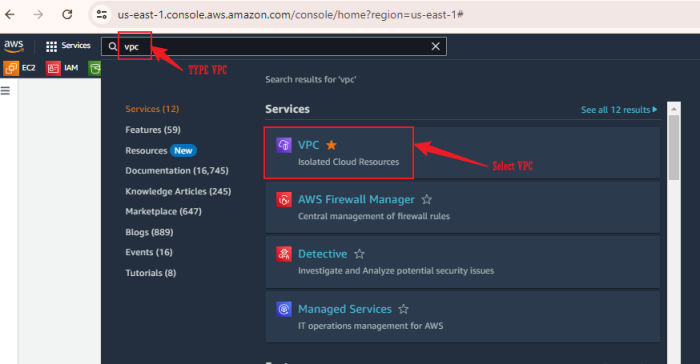

3. **Create an Internet Gateway:**
- In the VPC Dashboard, click on "Internet Gateways" in the left navigation pane.
- Click the "Create internet gateway" button.
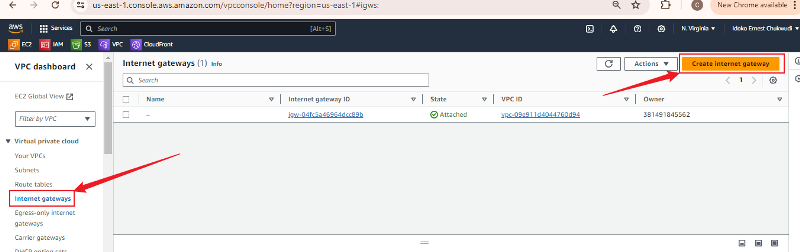
- Enter a name for your Internet Gateway (e.g., "MyInternetGateway").
- Click "Create internet gateway".
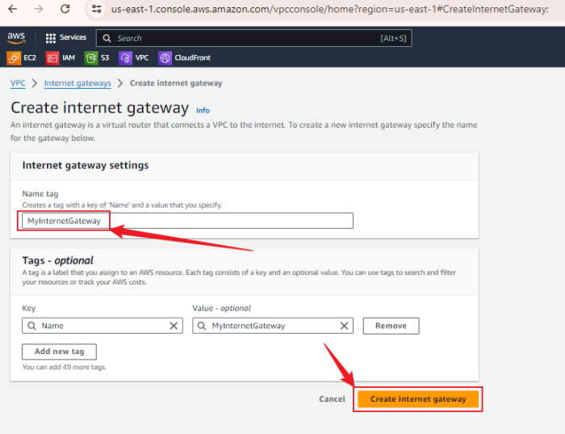

4. **Attach the Internet Gateway to Your VPC:**
- Select the newly created Internet Gateway.
- Click "Actions" and then "Attach to VPC".
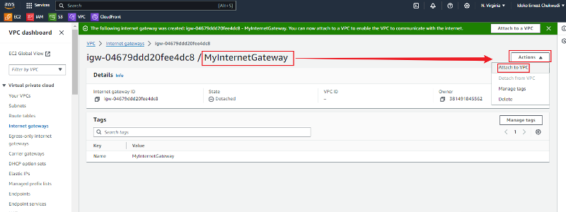
- Choose your VPC from the dropdown list and click "Attach internet gateway".
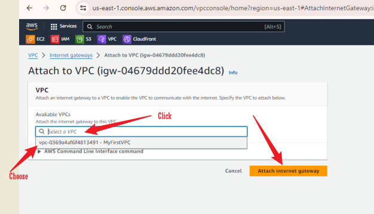

### Task 2: Create a NAT Gateway
1. **Navigate to the NAT Gateways Section:**
- In the VPC Dashboard, click on "NAT Gateways" in the left navigation pane.
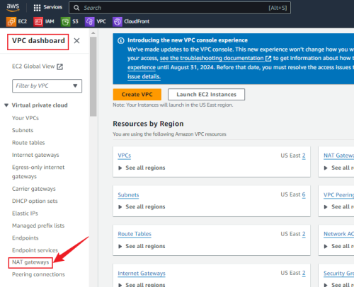

2. **Create a NAT Gateway:**
- Click the "Create NAT gateway" button.
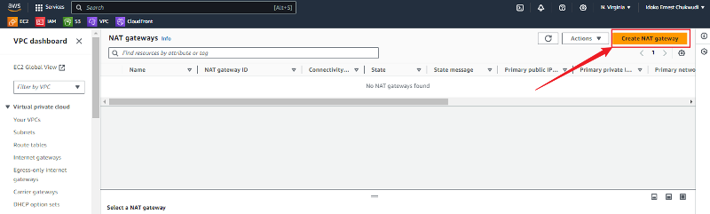

- Select the public subnet where you want to place the NAT Gateway.
- Choose an Elastic IP address for the NAT Gateway. If you don't have one, click "Allocate Elastic IP" and then "Allocate".
- Click "Create a NAT gateway".
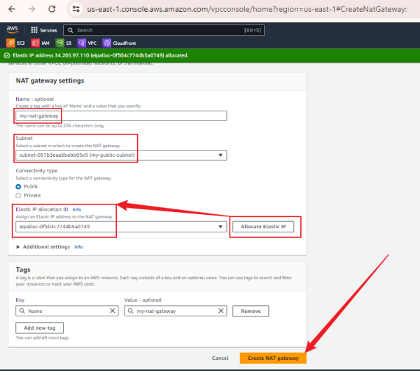

3. **Wait for the NAT Gateway to Become Available:**
- It may take a few minutes for the NAT Gateway to become available. Refresh the page to check the status.
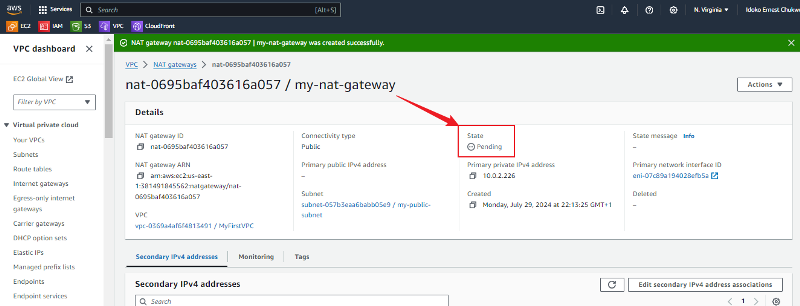
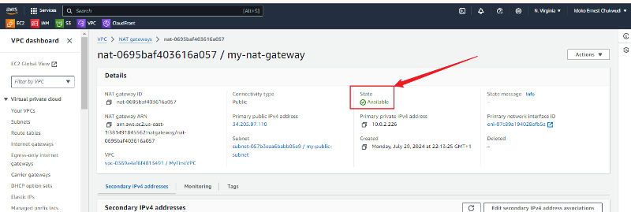

### Task 3: Configure Route Tables
1. **Configure the Route Table for the Public Subnet:**
- In the VPC Dashboard, click on "Route Tables" in the left navigation pane.
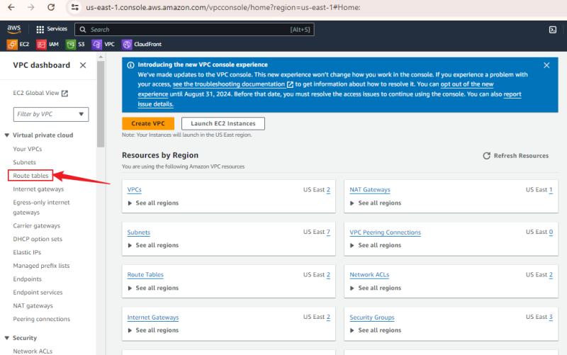
- Select the route table associated with your public subnet.
- Click on the "Routes" tab and then "Edit routes".
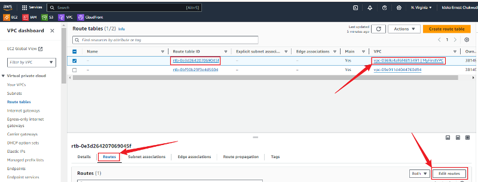
- Click "Add route".
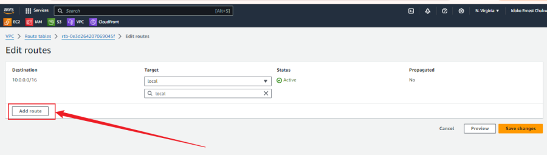
- For the Destination, enter "0.0.0.0/0".
- For the Target, select "Internet Gateway" and choose the Internet Gateway you created.
- Click "Save changes".
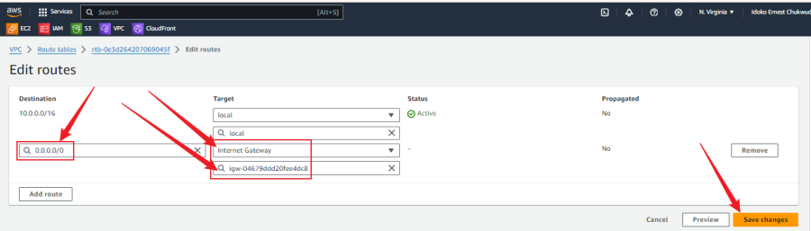

2. **Configure the Route Table for the Private Subnet:**
- Select the route table associated with your private subnet.
- Click on the "Routes" tab and then "Edit routes".
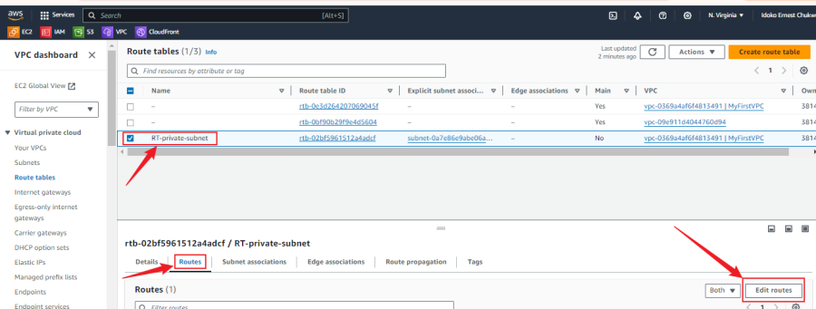
- Click "Add route".
- For the Destination, enter "0.0.0.0/0".
- For the Target, select "NAT Gateway" and choose the NAT Gateway you created.
- Click "Save changes".
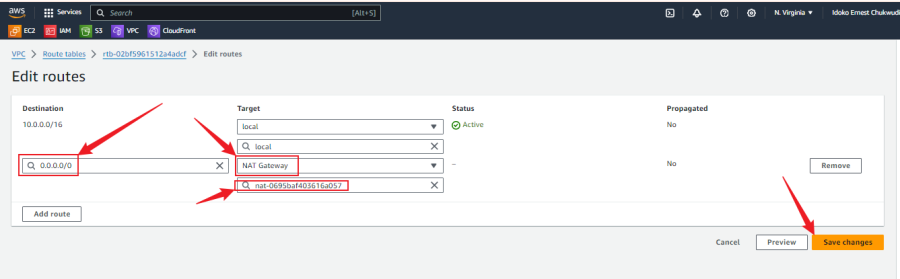

## Conclusion
In this mini project, we successfully created an Internet Gateway and a NAT Gateway, and configured route tables for a public subnet and a private subnet within an Amazon VPC using the AWS Management Console. The Internet Gateway allows resources in the public subnet to access the internet, while the NAT Gateway enables resources in the private subnet to access the internet through the public subnet. This setup enhances the security and functionality of the VPC by ensuring that the private subnet remains isolated from direct internet access.

## Reflection on the Role of Subnet in Network Segmentation
Subnets play a crucial role in network segmentation within a VPC by dividing the VPC into smaller, more manageable sections. Public subnets are used for resources that need direct access to the internet, such as web servers, while private subnets are used for resources that should not be directly accessible from the internet, such as databases. Configuring public and private subnets with appropriate route tables and gateways ensures secure and efficient network traffic management. Basic configurations, such as enabling auto-assign public IP for public subnets and setting up correct routing, are essential to make the network infrastructure functional and secure.